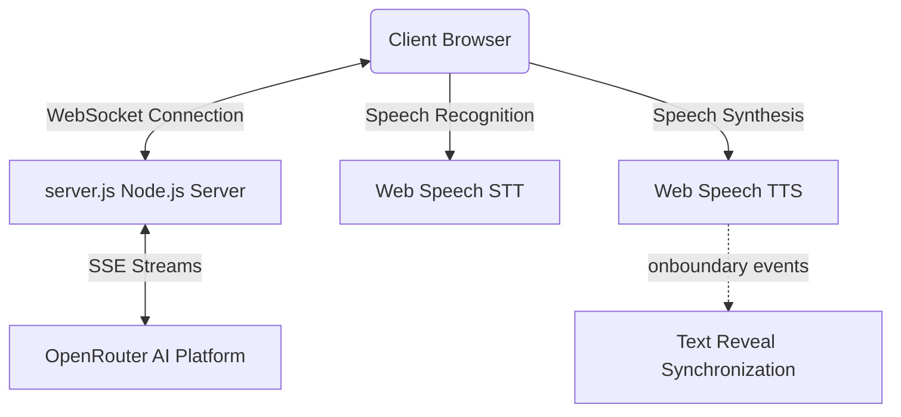

# Echo — Digital Sanctuary & Companion Space 🌟

[](https://nextjs.org)
[](https://tailwindcss.com)
[](https://www.typescriptlang.org)
[](https://echo-alpha-one.vercel.app/)

> Rebranding traditional social noise into a digital sanctuary. A private connection space to find AI companions, create genuine friendships, chat in real-time, and synchronize your moods.

🔗 **Production Deployment:** [https://echo-alpha-one.vercel.app/](https://echo-alpha-one.vercel.app/)

---

## ✨ Features

- **Meet Nora AI (Interactive Guide Widget):**
  - **Speech Synthesis (TTS):** Streams browser synthesis voice.
  - **Speech Recognition (STT):** Dictate queries with real-time SpeechRecognition.
  - **Word-by-Word Sync:** Text reveals itself in real-time, perfectly synchronized with Nora's spoken words using `SpeechSynthesisUtterance.onboundary`.
  - **Layout & Visualizer:** A stunning, compact glowing audio visualizer responsive to assistant status (`listening`, `thinking`, `speaking`, `idle`).
- **Interactive Sync:** Share live mood states, synchronise heartbeats, and check in with your inner circle.
- **Private Sanctuary:** Fully private chats and conversations with zero data selling, public profiles, or advertisement trackers.
- **Fully Responsive Design:** Crafted from the ground up to feel and look spectacular on desktop, tablet, and mobile displays.

---

## 🛠️ Tech Stack

- **Frontend:** Next.js (App Router), React, Tailwind CSS, Lucide Icons, Radix UI.
- **Backend Stream Server:** Node.js WebSocket server managing chat context history and SSE decoding.
- **AI Core:** OpenRouter API leveraging `google/gemma-4-31b-it:free`.
- **Integrations:** Web Speech API (`webkitSpeechRecognition` & `SpeechSynthesis`).

---

## ⚙️ Configuration & Environment

To run the application locally, set up the environment variables.

Create a `.env.local` file in the project root:

```env
# Client-side configuration
NEXT_PUBLIC_ASSISTANT_WS_URL=ws://localhost:3001

# Server-side configuration (WebSocket Server)
OPENROUTER_API_KEY=your_openrouter_api_key_here
PORT=3001
```

---

## 🚀 Getting Started

### 1. Install Dependencies
```bash
pnpm install
```

### 2. Run the Development Environment
Start both the Next.js dev server and the backend WebSocket stream server concurrently:
```bash
pnpm run dev
```

The app will be available locally at [http://localhost:3000](http://localhost:3000).

---

## 📐 Architecture & Layout



### Key Modules:
- **`components/landing-page.tsx`**: Main landing page layout showcasing responsive hero copy, layout spacing grids, and the integrated Nora AI assistant widget.
- **`components/assistant/audio-visualizer.tsx`**: Interactive orb statuses utilizing compact gradients and glowing keyframe animations.
- **`hooks/use-voice-assistant.ts`**: Speech recognition handlers, stream state controllers, and word-boundary text reveal sync.
- **`server.js`**: Background WebSocket stream server decoding OpenRouter's SSE streams chunk by chunk and routing the results.
